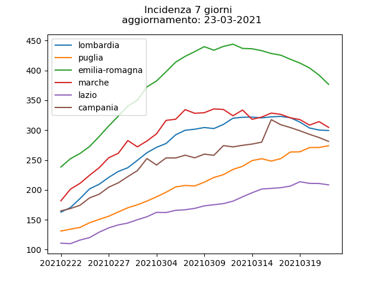
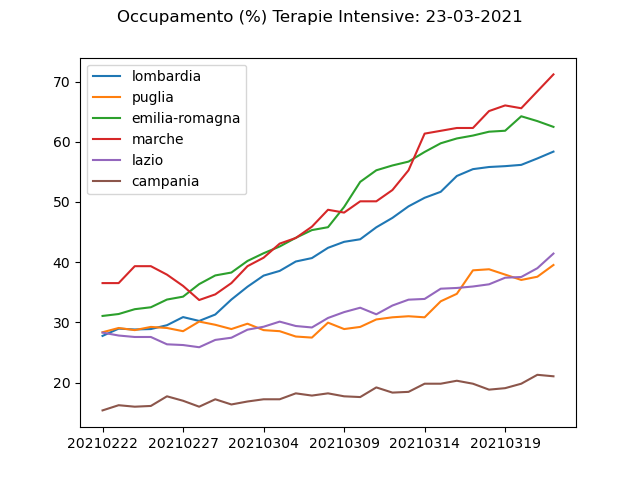

# Covid-19 in Italia

Aggiornamento quasi quotidiano.

Dati demografici da: [istat](http://dati.istat.it/Index.aspx?DataSetCode=DCIS_POPRES1).

Dati sul contagio da: [protezione civle](https://github.com/pcm-dpc/COVID-19).

## Nuovi casi
La protezione civile fornisce dati sui contagi totali giornalieri. 
I nuovi contagi si ricavano facendo la la differenza dei totali fra un giorno e il precedente.
I nuovi contagi giornalieri sono mediati su una finestra temporale di 7 giorni per ottenere un andamento robusto e meno influenzato dalle variazioni giornaliere.

Per ottenere i dati sull'incidenza si incrociano opportunamente i dati sui contagi con quelli demografici.

## Andamento Per Provincia
Nuovi casi e Incidenza nell'ultimo mese.

## Andamento Per Regioni
Incidenza e Occupazione Terapie Intensive nell'ultimo mese.

